## Часть 1. Установка ОС
- Установка **Ubuntu 20.04 Server LTS** без графического интерфейса.
- Проверка версии OS командой: `cat /etc/issue`

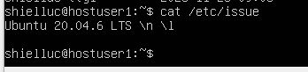

### Отображение версии OS
- Отображение версии OS

 

## Часть 2. Создание пользователя

- Скриншот вызова команды для создания пользователя admin1:

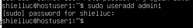

- Добавление пользователя в группу adm:

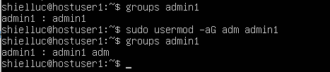

`groups admin1` - отображает все текущие группы пользователя admin1
`usermod -aG adm admin1` - добавление пользователя admin1 в группу adm
флаги 
`-a`  -добавляет пользователя в новую группу не удаляя из прошлых
`-G` указывает на группу для добавления

- Новый пользователь присутствует в выводе команды:  
`cat /etc/passwd`:

## Часть 3. Настройка сети ОС

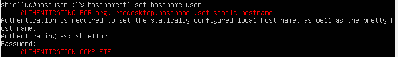

`hostnamectl set-hostname user-1` -команда устанавливает имя ВМ user-1

- Вывод текущего названия ВМ:

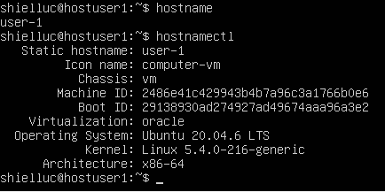

`hostname` - Команда выводит текущее имя хоста вм
`hostnamectl` - По умолчанию команда отображает текущее имя хоста и другую информацию о системе

- Установка часового пояса, соответствующего текущему местоположению:
`timedatectl list-timezones` - командой можно вывести все доступные часовые пояса, для нахождения нужного
Для Москвы нам подходит Europe/Moscow

`sudo timedatectl set-timezone` - устанавливает заданный часовой пояс
`timedatectl` - проверить текущий часовой пояс

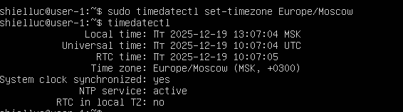

текущий часовой пояс

- Выведение имен сетевых интерфейсов с помощью консольной команды:

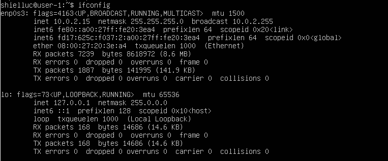

`ifconfig` - без аргументов команда выводит информацию о всех активных интерфейсах

- Пояснение наличию интерфейсов:
	 **enp0s3** - сетевой интерфейс для подключения сети
	 **lo** - Это интерфейс loopback. интерфейс обратной петли, позволяет компьютеру обращаться к самому себе.  
	Интерфейс имеет ip-адрес `127.0.0.1` и необходим для нормальной работы системы.

- Получение IP-адреса устройства, с которым работаем, от DHCP-сервера.
	Первоначально ip отсутствует, либо можно освободить командой 
	`dhclient -r enp0s3` 
	
	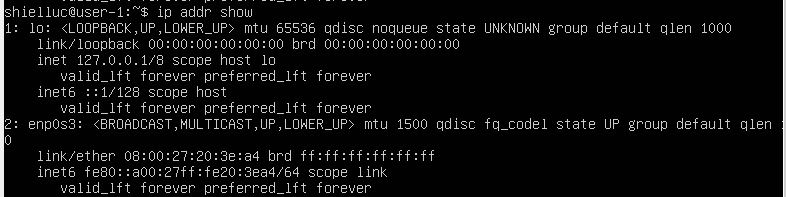	
	
	Запрашиваем новый ip от сервера:

	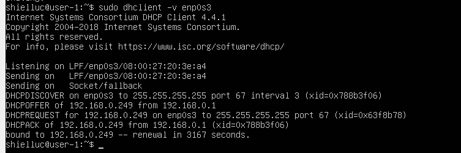

	`dhclient -v enp0s3` - запрашиваем новый ip от сервера

- Расшифровка DHCP.
	DHCP - Dynamic Host Configuration Protocol - протокол служит для назначения IP-адреса клиенту.

- Определение и отображение внешнего IP-адреса шлюза (ip) и внутреннего IP-адреса шлюза(IP-адрес по умолчанию (gw)).
	**Внутренний IP-адрес** (частный IP-адрес) — это адрес, который присваивается устройству или сети внутри локальной сети, используется только для обмена данными между устройствами в сети. 
	**Внешний IP-адрес** (публичный IP-адрес) — это адрес, который присваивается устройству или сети провайдером интернет-услуг, используется для идентификации устройства в интернете.
	
	Отображение внешнего IP-адреса шлюза:

	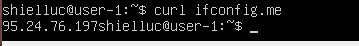

	команда curl `ifconfig.me` показывает публичный ip адрес, который назначается провайдером для конкретной подсети
	
	Отображение внутреннего IP-адреса самой ВМ:

	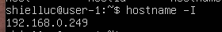

	команда hostname -I с данным аргументом можно узнать не просто название ВМ, но и её ip.
	
	Отображение ip шлюза:

	 

	`ip route` - команда отображает таблицу маршрутизации и ip-адрес шлюза, используемого по умолчанию - 192.168.0.1 - то есть непосредственно нашего роутера, через который устройство обращается в глобальную сеть

- Установка статических (заданных вручную, а не полученные от DHCP-сервера) настройки IP, GW, DNS (используйте публичные DNS-серверы, например, 1.1.1.1 или 8.8.8.8).
	
	ip можно также установить статически вместо получения ip от DHCP сервера.
	Для этого воспользуемся командой `ip addr add 192.168.0.64/24 dev enp0s3`
	
	Проверка статически добавленного ip:

	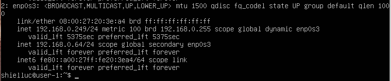

	Проверяем добавление адреса снова командой `ip addr show`, видим появление новой строчки 192.168.0.64/24.
	
	Также можно задать Default gateway шлюз по умолчанию с помощью команды:
	`ip route add default via 192.168.0.10 dev enp0s3 metric 200`
	192.168.0.10 - добавляем ip шлюза по умолчанию
	metric 200 - добавляем метрику, чтобы на данный момент он был не приоритетным.
	
	Теперь ip route покажет два адреса по умолчанию:

	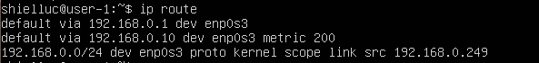
	
	Но данные команды позволяют использовать эти настройки в рамках данной сессии, то есть при перезагрузке ВМ настройки потеряются.
	Чтобы этого не произошло, изменения необходимо зафиксировать в конфигурационных файлах Linux.
	Откроем файл /etc/netplan/00-installer-config.yaml редактором nano:

	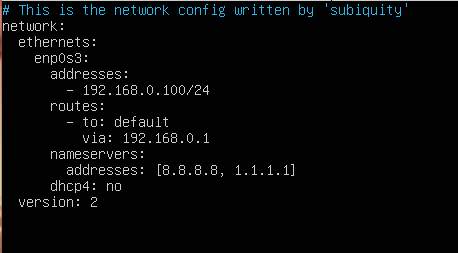
	
	После заполнения полей сохраняем изменения и выходим.
	`netplan try` - можно проверить нет ли ошибок в файле конфигурации
	`netplan apply` - позволяет применить изменения в файле конфигурации
	
	Проверяем текущие настройки. И видим что ip изменился на 192.168.0.100

	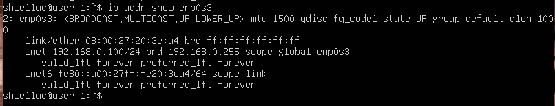
	
	Также и для шлюза по умолчанию появилось конкретное указание, что адрес выделен статически:

	

- Перезагрузка виртуальной машины командой reboot
- Проверяем, что статические сетевые настройки (IP, GW, DNS) соответствуют настройкам, заданным в предыдущем пункте:
	После включения ВМ, также проверим текущие параметры:
	Вывод команды `ip addr show enp0s3`:

	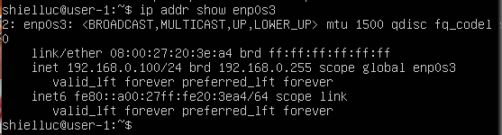
	
	Вывод команды `ip route`:

	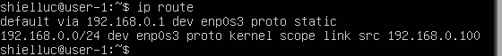
	
	Команда` resolvectl status enp0s3` покажет наши DNS:

	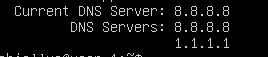

- Выполнение проверки доступности хостов пингом:
	Отправим по 4 пакета на каждый хост.
	ping 1.1.1.1:

	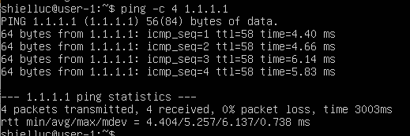
	
	ping ya.ru:

	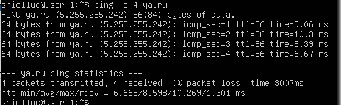

	В выводе команды указано «0% packet loss», то есть хосты отвечают и доступны.

## Часть 4. Обновление ОС

- Обновляем системные пакеты до последней версии:

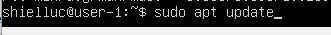

- После обновления системных пакетов, снова введем команду обновления, должно появиться сообщение об отсутствии обновлений:

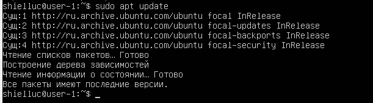

## Часть 5. Использование команды **sudo**

- Разрешить пользователю выполнять команду sudo.

	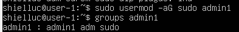

	`sudo usermod -aG sudo admin1` -добавляет группу sudo пользователю admin1
	в выводе `groups admin1` -теперь можно увидеть появившуюся группу sudo

- Истинное назначение команды sudo
	sudo - сокращение от substitute user and do - данная утилита позволяет выполнять операции, требующие прав root, но условно под любой учетной записью, не переключаясь непосредственно на root.
	Для этого пользователь должен быть добавлен в группу sudo.
- Изменение имени хоста ОС с помощью созданного пользователя admin1
	Заходим в учетную запись admin1:

	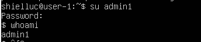
	
	Изменяем имя хоста командой `hostnamectl set-hostname`
	И проверяем командой `hostname`:

	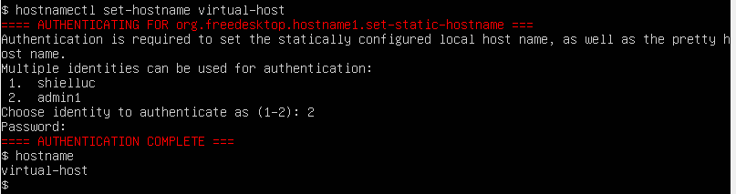

## Часть 6. Установка и настройка службы времени

- Настройка службы автоматической синхронизации времени
	`sudo apt update && sudo apt install ntp` - устанавливаем пакет ntp
	`sudo service ntp start` - запуск службы ntp
	
	Открываем файл конфигурации в редакторе:
	`sudo nano /etc/ntp.conf`
	
	В файле конфигурации необходимо добавить пул ntp серверов:
	server 0.ru.pool.ntp.org iburst
	server 1.ru.pool.ntp.org iburst
	server 2.ru.pool.ntp.org iburst
	server 3.ru.pool.ntp.org iburst
	
	Опция `iburst` отвечает за отправку на сервер для синхронизации несколько пакетов вместо одного, используется для повышения точности синхронизации.
	
	Чтобы изменения вступили в силу необходимо перезапустить сервис и проверить его статус:

	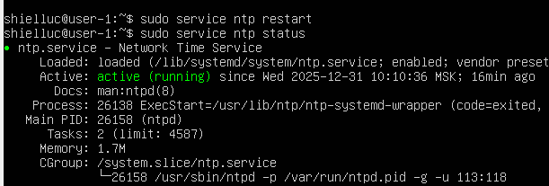
	
	Проверим работоспособность синхронизации:

	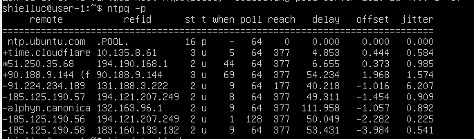
	
	Знаком `*` - указан сервер, который используется в данный момент для синхронизации времени.

- Вывод команды `timedatectl show`:
	
	Содержит `NTPSynchronized=yes`:

    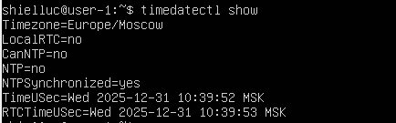

     Время текущего часового пояса - Europe/Moscow

## Часть 7. Установка и использование текстовых редакторов

-  Установка текстовых редакторов **VIM** , **NANO** , **MCEDIT**
	`sudo apt update` 
	`sudo apt install mcedit`
	`sudo apt install nano`
	`sudo apt install vim`
	Если пакет уже установлен, будет выведено соответствующее сообщение.

- Создание файла _test_X.txt_ , где X — имя редактора, в котором создан файл. 
	**Открываем файл в VIM**:
	`vim test_vim.txt`
	
	Для перехода в режим редактирования нажимаем `i` - insert
	
	Редактируем содержимое:

	
	
	Для выхода из режима редактирования нажимаем `Esc`
	
	Выходим из редактора с сохранением изменений:
	Прописываем - `:wq`
	 Двоеточие служит для указания системе, что сейчас будет передана команда
	 `w `- write - записывает изменения
	 `q` - quit -выходит из редактора
	
	
	**Открываем файл в NANO**:
	`nano test_nano.txt`
	
	Редактируем содержимое:

	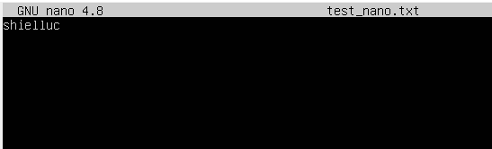
	
	Выходим из редактора с сохранением изменений:
	**Ctrl + X** - по данной комбинации клавиш осуществляется выход из редактора NANO
	
	Если при этом есть несохраненные изменения в документе, будет предложено их сохранить.
	Необходимо подтвердить клавишей `Y`:

	
	
	Следующим шагом при необходимости можно будет переименовать редактируемый файл:

	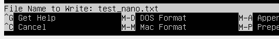
	
	Либо просто подтверждаем текущее название клавишей `Enter`
	
	**Открываем файл в MCEDIT:**
	`mcedit test_mcedit.txt``
	
	Редактируем содержимое, добавляем ник:

	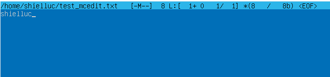
	
	Выходим из редактора с сохранением изменений:
	**F10** - по нажатию клавиши осуществляется выход из редактора MCEDIT
	
	Если при этом есть несохраненные изменения в документе, будет предложено их сохранить.
	Необходимо подтвердить:

	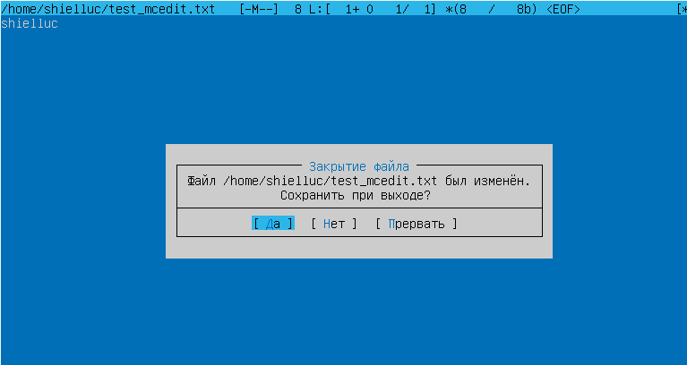
	
	Либо можно самостоятельно сохранить файл нажатием `F2`:

	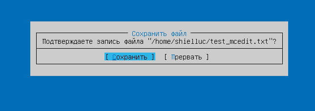

	Что тоже необходимо будет подтвердить.

-  Используя каждый из трех выбранных редакторов, открываем файл для редактирования, отредактируем файл, заменив псевдоним на строку «21 School 21», закроем файл, не сохраняя изменения.
	**Открываем файл в VIM**:
	Скриншот после редактирования:

	
	
	Чтобы выйти без изменений:
	1. Выходим из режима редактирования нажатием `Esc`
	2. Прописываем команду - `:!q` без записи:

	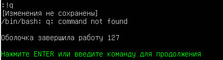
	
	**Открываем файл в NANO:**
	Скриншот после редактирования:

	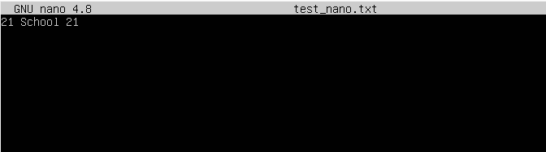
	
	Чтобы выйти без изменений:
	1. **Ctrl + X** - для выхода из редактора NANO
	2. Необходимо отказаться от внесения изменений клавишей `N`:

	
	
	**Открываем файл в MCEDIT:**
	Скриншот после редактирования:

	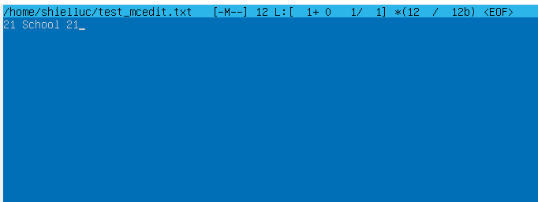

	Чтобы выйти без изменений:
	1. **F10** - по нажатию клавиши осуществляется выход из редактора MCEDIT
	2. Необходимо отказаться от внесения изменений:

	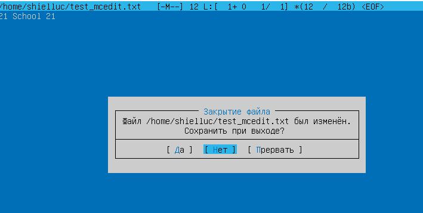

- Используя каждый из трех выбранных редакторов, еще раз отредактируем файл (аналогично предыдущему пункту)
	**Отредактируем VIM:**

	
	
	**Отредактируем NANO:**	
	
	
	
	**Отредактируем MCEDIT:**

	

- Применим функции поиска по содержимому файла (слову) и замены слова на любое другое.
    **Редактор VIM:**
    Для поиска слова
    1. Необходимо нажать   `/`(поиск вперед) или `?` (поиск назад)
    2. Ввести шаблон поиска
    3. Нажать `Enter`
    4. Нажать` n` - для поиска следующего вхождения или `N` в верхнем регистре для поиска в обратном направлении.
    
	Поиск слова:

	
	
	Выделение найденного в файле фрагмента:

	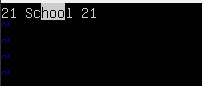
	
	Замена слова:
	Синтаксис команды
	`:s/<слово для поиска>/<на что заменить>/опции`
	Вводим команду для замены 21:

	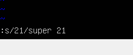
	
	В данном случае первая 21 заменилась:
	
	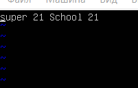
	
    Чтобы заменить все вхождения можно использовать флаг g:
    
	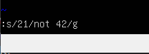
    
    Результат изменения:
    
	
    
    **Редактор NANO:**
	Поиск слова:
	1. Нажать `CTRL + Q` (поиск вперед) 
	2. Внизу появится окно с поиском:
	
	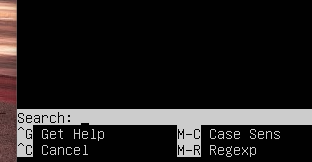
	
	3. Наберем 21:
	
	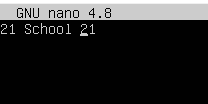
	
	Вхождение начинает подчеркиваться, мигать, выделяя первый символ из поиска.
	
	Можно использовать комбинацию клавиш `ALT + W` для перехода к следующему вхождению.
	
	Замена слова:
	Поменяем `21` на `super 21`
	1. Нажать `CTRL + \` (поиск и замена)
	
	
	
	2. Выбираем режим, например, `All`:
	
	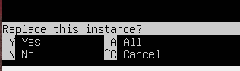
	
	3. Как итог оба вхождения изменились:
	
	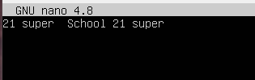
	
	**Редактор MCEDIT:**
	Поиск слова:
	1. Нажимаем Alt  + S:
	
	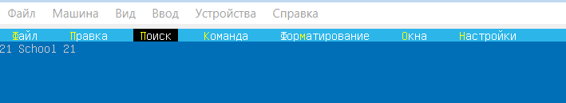
	
	2. Начинаем вводить текст `21` для поиска:
	
	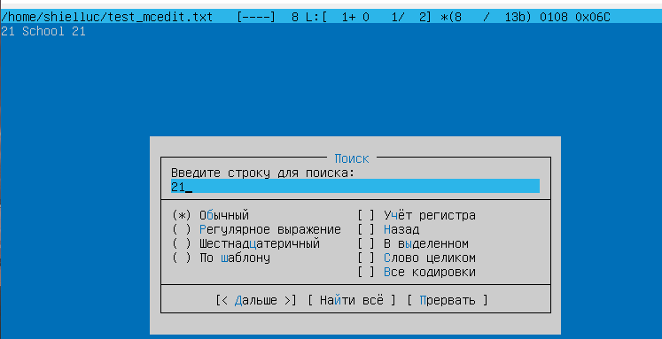
	
	3. После нажатия `Enter` начинает подсвечиваться вхождение поиска:
	
	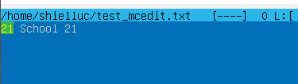
	
	Замена слова:
	1. Нажимаем клавишу `F4`, появляется окно для заполнения:
	
	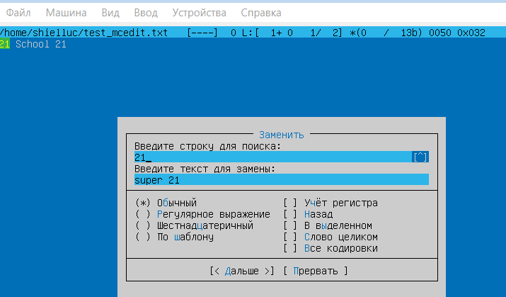
	
	2. Нажимаем Enter и подтверждаем замену:
	
	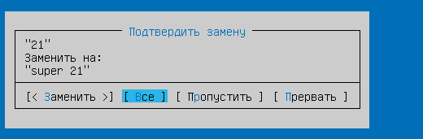
	
	3. Как итог выбрав Все, получаем две замены:
	
	

## Часть 8. Установка и базовая настройка сервиса **SSHD**

- Установим службу SSHd.
	sudo apt update
	sudo apt-get install openssh-server

-  Добавим автоматический запуск службы при каждой загрузке системы.
	sudo systemctl enable ssh
	
	После перезагрузки статус службы останется active:
	
	

-  Сбросим службу SSHd на порт 2022.
	1) Сделаем резервную копию файла конфигурации
	`cp /etc/ssh/sshd_config /etc/ssh/sshd_config.backup`
	2) Необходимо отредактировать этот файл
	`sudo nano /etc/ssh/sshd_config`:
	
	
	
	3) Раскомментируем строчку содержащую Port и заменим его на 2022:
	
	

-  Покажем наличие процесса sshd с помощью команды ps:
	
	
	
	`ps -e` - выводит список всех запущенных процессов в системе
	`grep sshd` - ограничивает круг до конкретного вхождения sshd

- Перезагрузим систему
	`reboot`

- Проверим вывод команды netstat
	`netstat -tan`:
	
	
	
	ключи в команде:
	`t `- отображает TCP соединения
	`a` - показывает все прослушивающие порты
	`n` - показывает числовые адреса вместо названий хостов и портов
	
	Столбцы в выводе:
	Proto - Протокол (TCP/UDP)
	Recv-Q - Данные, ожидающие получения
	Send-Q - Данные, ожидающие отправки
	Local Address - локальный адрес, конечная точка соединения
	Foreign Address - удаленная конечная точка соединения
	State - Состояние соединения
	(Например,
	- ESTABLISHED — соединение установлено;
	-  LISTEN — сокет слушает входящие соединения.
	- SYN_SENT — сокет активно пытается установить соединение;
	- SYN_RECV — запрос на соединение получен из сети;
	- FIN_WAIT1 — сокет закрыт, соединение закрывается;
	- FIN_WAIT2 — соединение закрыто, сокет ждёт завершения с удалённого конца;
	- TIME_WAIT — сокет ждёт после закрытия, чтобы обрабатывать пакеты, ещё находящиеся в сети;
	- CLOSE — сокет не используется;)

## Часть 9. Установка и использование утилит **top** , **htop**

-  Установка утилиты top и htop.
	`sudo apt update`
	`sudo apt-get install procps`

- Запуск top
	В командной строке набираем top и нажимаем Enter
	Появляется следующий вывод:	
	
	
	
	В выводе **первая строчка отображает:**
	- текущее время
	- время работы системы - 53 мин
	- количество пользователей, подключенных к системе
	- `load average` - три числа, которые показывают, насколько загружен компьютер относительно количества процессоров/ядер процессора. Они дают средние значения за 1, 5 и 15 минут.
	**Вторая строчка:**
	- `Tasks`- общее количество задач 
	- `running` - задачи, которые активно обслуживались во время последнего цикла опроса
	- `sleeping` -  задачи, которые не были активны в последнем цикле опроса.
	- `stopped` - задачи, которые остановлены нажатием клавиши Ctrl-Z.
	- `zombie` - задачи, для которых родительский процесс больше недоступен и, следовательно, их нельзя остановить или управлять ими.
	**Третья строчка:**
	- `us` - объем нагрузки пользовательских процессов(запущенные без root и не имеющих прямого доступа ядру)
    -  `sy` - объем нагрузки системных процессов(запущенные от root и имеющих прямой доступ к ядру)
    - `ni` - процессы, приоритет которых был настроен с помощью команды `nice`
    - `id`- процент бездействия в системе
    - `wa` - количество времени, которое система провела в режиме ожидания ввода-вывода. 
    - `hi` - количество времени, потраченное на обработку аппаратных прерываний    
    - `si` - количество времени, которое система потратила на обработку программных прерываний
    - `st` - указывает количество времени, которое было украдено у процессора текущего компьютера другими виртуальными машинами.
	**Четвертая строчка:**
	- `total` - общий объем памяти в мегабайтах, доступный в виде физической установленной оперативной памяти
	- `free` - объем памяти, который в данный момент ни для чего не используется
	- `used` - объем памяти, используемый в текущий момент программами и службами.
	- `buff/cache` - объем памяти, используемый для кэширования запросов на чтение и запись
	**Пятая строчка:** 
	Отображает аналогичную 4 строчке информацию, только при выделении дополнительной памяти для swap.
	
	**Столбцы вывода:**
	- `PID` - уникальный идентификатор процесса
	- `USER` - имя пользователя, запустившего процесс
	- `PR` - приоритет процесса
	- `NI` - указывает, какой из процессов с одинаковыми приоритетами имеет больший приоритет
	- `VIRT` - общий объем памяти, выделенный процессу - запрошенная память - зарезервированный диапазон адресов
	- `RES` - объем резидентной памяти - памяти, которая выделена процессу и которая в настоящее время активно используется
	- `SHR` - обычно это библиотеки, используемые процессом, которые также используются другими процессами
	- `S` - состояние процесса
	- `%CPU` - процент циклов процессора, использованных процессом
	- `%MEM` - процент памяти, используемый процессом
	- `TIME` - суммарное реальное время, в течение которого процесс использовал процессор в течение всего периода с момента его запуска
	- `COMMAND` - команда, которая использовалась для запуска этого процесса

- Из вывода команды top определим следующие показатели:
    - время безотказной работы: **53 минуты**
    - количество авторизованных пользователей: **1**
    - средняя загрузка системы: **0,00 0,01 0,00**
    - общее количество процессов: **125**
    - загрузка процессора: **0.0 us 0.1 sy**
    - загрузка памяти: **180.6 Mb/3919.5 Mb**
    - pid процесса с наибольшим использованием памяти: **1** 
    - pid процесса, занимающего больше всего процессорного времени: **1**

- Запуск htop
	В командной строке набираем htop и нажимаем Enter
	Появляется следующий вывод:
	
	Для сортировки нажимаем F6 и выбираем по какому параметру сортировать:
	- сортировка по PID:
	
	
	
	- сортировка по PERCENT_CPU: 
	
	
	
	- сортировка по PERCENT_MEM:
	
	
	
	- сортировка по TIME:
	
	
    
	- Отфильтровано для процесса sshd
		Нажмем клавишу F4 и введем sshd:
	
		
    
	- Процесс syslog, найденный с помощью поиска
	    Нажмем клавишу F3 и введем syslog:
	
	    
    
    - Добавляем имя хоста, часы и время безотказной работы в вывод:
	    Нажимаем F2 и добавляем нужные данные:
	
	    

## Часть 10. Использование утилиты **fdisk**

-  Выполним команду `fdisk -l`:
	l - вывести все разделы на всех устройствах
	вывод команды:
	
	

	 - название жесткого диска - **/dev/sda**
	 - емкость - **20Gb**  
	 - количество секторов - **41943040**
	 - размер раздела подкачки - **0**

## Часть 11. Использование утилиты **df**

- Выполним команду `df`:

	
	
	Для корневого раздела (/):
    - размер раздела - **10218772 KB**
    - используемое пространство - **3274104 KB**
    - свободное пространство - **6403996 KB**
    - процент использования - **34%**

-  Выполним команду `df -Th`:
	
	
	ключи:
	`h` - преобразует размер к гигабайтам
	`T` - отображает тип файловой системы раздела
	
	Для корневого раздела (/):
    - размер раздела - **9.8 Gb**
    - используемое пространство - **3.2 Gb**
    - свободное пространство - **6.2 Gb**
    - процент использования - **34%**
    - тип файловой системы для раздела - **ext4**

## Часть 12. Использование утилиты **du**

-  Выполним команду du:
	Она начнет выводить информацию сразу по всем разделам системы:
	
	

- Выведем размер папок (в удобочитаемом формате):
	Будем использовать ключи:
	`s `- вывод только размера указанного каталога, без включения подкатегорий
	`h` - вывод размеров в удобночитаемом формате
	
	`du -sh /home`:
	
	
	`sudo du -sh /var`:
	
	
	
	Выведем размер всего содержимого в /var/log
	`sudo du -h /var/log`:
	
	

## Часть 13. Установка и использование утилиты **ncdu**

- Установим утилиту ncdu
	`sudo apt update`
	`sudo apt-get install ncdu`
	
	

- Выведем размер папок 
	`ncdu /home`:
	
	
	
	`ncdu /var`:
	
	
	
	`ncdu /var/log`:
	
	

## Часть 14. Работа с системными журналами

- Открываем для просмотра:
	`sudo nano /var/log/dmesg:`
	
	
	
	`sudo nano /var/log/syslog:`
	
	
	
	`sudo nano /var/log/auth.log:`
	
	

- Время последнего успешного входа в систему, имя пользователя можно вывести из данного файла следующей командой:
`cat /var/log/auth.log | grep "New session"`:

- Перезапустим службу SSHd
	`systemctl resstart sshd`
- Cнимок экрана c сообщением о перезапуске службы
`cat /var/log/auth.log | grep "sshd"`:

## Часть 15. Использование планировщика заданий **CRON**

- Используя планировщик заданий, запустим команду uptime каждые 2 минуты:
	Откроем планировщик  cron командой
	`crontab -e`
	Допишем * /2 * * * *:

- Найдем строки в системных журналах о выполнении:
	`cat /var/log/syslog | grep CRON`:

	

- Отобразим список текущих заданий для CRON
	`crontab -l`:

	

- Удалим все задачи из планировщика заданий
	`crontab -r`

- Cнимок экрана со списком текущих задач для CRON:

	